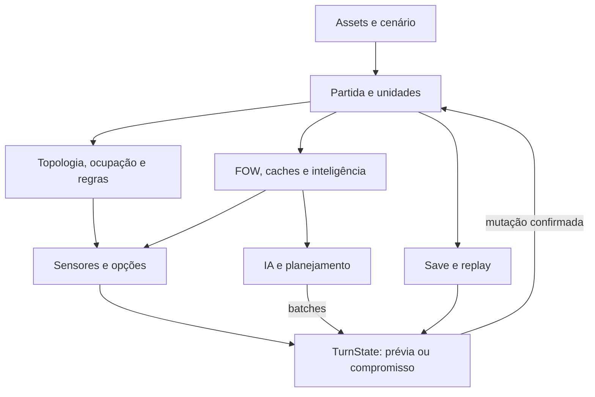

# The Map Room — reconhecimento inicial de arquitetura

Data: 08/10/2026. Repositório: `alanramires/theMapRoom`, branch `main`.
Commit analisado: `3da75fd42d547d5803197f664ea04c4d8f1a8377`, de 06/10/2026, mensagem “Resumo: aponta o estado pos-v9.3.2”.

## Conclusão

O projeto já possui uma arquitetura de jogo de estratégia substancial: regras configuráveis por assets, ocupação por camadas, ações canceláveis, névoa com caches e revisões, IA com planejamento e execução por fases, campanha, persistência e replay. Há separações úteis entre regras, sensores, dados e execução. O maior risco é a quantidade de responsabilidades compartilhadas pelos grandes controladores e a necessidade de manter vários retratos do tabuleiro coerentes.

A prioridade recomendada é proteger o contrato transacional com verificações reproduzíveis e reduzir divergências entre simulação e execução. Uma reescrita ampla, migração para ECS/DOTS ou troca do modelo de dados não se justifica com as evidências deste reconhecimento. Desempenho deve ser medido antes de escolher essa direção.

## Escopo e limites

Inspeção estática do código, configurações, estrutura, documentação arquitetural e amostras dos principais fluxos. Os arquivos fornecidos de fonte única, ciclo de ação, pendências, auditoria e manifesto foram usados como referência de intenção. As pendências antigas foram comparadas com trechos do commit atual; não foram aceitas automaticamente como bugs atuais.

Não executei o jogo, não compilei um player e não medi CPU, memória ou GC. Não há executável Unity disponível neste ambiente. Esta é uma análise inicial, não auditoria exaustiva de todos os sensores, assets, cenas ou regras. Nenhum arquivo versionado foi alterado; os diffs de trabalho e de staging permaneceram vazios. O relatório foi criado fora do checkout.

## Dimensão e organização

- Unity declarado: **6000.5.3f1**.
- `Assets/Scripts`: **479 arquivos C#**, dos quais **45** estão em `AI_Legacy~`. Excluindo essa pasta, há **434 arquivos**, aproximadamente **227 mil linhas físicas**, incluindo editor, comentários e linhas vazias. A contagem não equivale a código de produção compilado.
- `MatchController.cs`: **11.973 linhas**.
- `TurnStateManager` e seus arquivos: **33.166 linhas**.
- Arquivos cujo nome começa com `AIController`: **52.639 linhas**, incluindo suas extensões funcionais.
- `SaveGameManager.cs`: **3.563 linhas**; `ReplayManager.cs`: **4.245 linhas**.
- Não encontrei `.asmdef`, workflows em `.github` nem testes NUnit/UnityTest no código inspecionado. Existe um programa de checks para `MessageTemplate` em `tools/tests/MessageTemplateChecks` e há roteiros de teste manual em `docs/testes`.

Separar arquivos com `partial` melhora navegação, mas continua sendo uma única classe, com acesso ao mesmo estado privado. O projeto está organizado por pastas e convenções; não há fronteiras de assemblies próprias impondo dependências.

## Principais sistemas e dependências

| Sistema | Pontos de entrada e componentes | Dependências e papel |
|---|---|---|
| Campanha e cenários | `CampanhaManager`, `QuadranteController`, `MundoData`, `BlocoData`, `CampanhaData`, `QuadranteData`, `CampaignProgressStore` | Dados autorados/assados alimentam a batalha; progresso guarda dono por slot e resultado. Depende de identidade estável e regras de vitória. |
| Partida, economia e vitória | `MatchController`, `PartidaConfig` | Mantém turno, slots, dinheiro, observadores e término da partida; também concentra grande parte da visão/detecção. É um ponto central de integração. |
| Estado e execução das ações | `TurnStateManager`, `CursorController`, `AnimationManager` | Seleção → posição provisória → sensores → confirmação ou rollback. Integra recursos, combate, captura, transporte, logística, menus e replay. |
| Dados e balanceamento | `UnitData`, `WeaponData`, `TerrainTypeData`, `ConstructionData`, `ServiceData`, databases RPS/DPQ/skills | ScriptableObjects e assets fornecem regras e valores. São dependências funcionais do motor, não apenas conteúdo visual. |
| Hexágonos e ocupação | `BoardTopologyData`, `BoardTopologyIndex`, `ConfirmedOccupancyIndex`, `UnitOccupancyRules`, `OccupancyResolver` | Topologia e consultas por célula/camada; índice derivado do estado confirmado. Filtragem por mapa/cena é necessária. |
| Movimento e autonomia | `UnitMovementPathRules`, `MovementReachCache`, `OperationalAutonomyRules`, `LayerTransitionRules`, regras aéreas | Terreno, infraestrutura, ocupação, capacidades e combustível determinam caminhos. Cache compartilhado tem chave extensa e limites de capacidade. |
| Sensores de ação | `PodeMirarSensor`, `PodeDesembarcarSensor`, `PodeSuprirSensor`, `PodeTransferirSensor` e demais sensores | Produzem possibilidades e motivos de recusa. Dependem de posição, camadas, ocupação e conhecimento do observador; não podem transformar verdade oculta em informação. |
| Combate | `TurnStateManager.Combat`, `AICombatHpSimulator`, `CombatEvaluationService`, `CombatModifierResolver`, `UnitCounterEvaluator` | Execução e previsão usam armas, RPS, DPQ, HP, modificadores e revide. O serviço de avaliação já recebe uma opção canônica do sensor, mas ainda oferece fallback legado. |
| Névoa e inteligência | `MatchController`, `FogOfWarController`, `TerrainVisionResolver`, `ThreatRevisionTracker`, `AIIntelLedger` | Distingue visão, memória e detecção, com revisões e caches. Precisa observar apenas o estado confirmado e respeitar slot/observador. |
| Logística e transporte | Partials `CommandService`, `Supply`, `SupplyQueue`, `Transfer`, `Disembark`, `Merge`; dados de serviços e fornecedores | Consome dinheiro e estoques; altera múltiplas unidades e cadeias de passageiros. Tem ampla dependência de camada, capacidade, turno e ocupação. |
| IA | `AIController`, `AIWorldSnapshot`, `ObjectiveManager`, `AITacticalAnalyzer`, `AIShoppingPlanner`, serviços `Melhor*` | Planeja objetivos, iniciativa, missões e compras. Executa ações por batches e reutiliza infraestrutura de ação/replay; precisa reconstruir contexto após commits e load. |
| Save e replay | `SaveGameManager`, DTOs/mapper, `MatchStateHasher`, `ReplayManager`, `PlayerAction` | Persistência versionada, restauração de estado, linha do tempo e execução automatizada. Fortemente conectados a FOW, IA, campanha e FSM. |
| Apresentação e ferramentas | HUDs/UI, câmera, áudio, editores, `PlanningManager` | Expõe e edita dados; acompanha seleção e fluxo. Algumas mensagens e decisões de apresentação aparecem dentro dos controladores de regras. |

As cenas habilitadas no build são `Tela de Entrada`, `Campanha` e `Batalha`. Mapas de desenvolvimento, hotseat e tutoriais aparecem desabilitados na lista; isso não prova que seus dados não possam ser usados pela batalha dinâmica.

Pacotes declarados incluem Input System 1.19.0, UGUI 2.5.0, Test Framework 1.7.0, Timeline 1.8.12 e Feature 2D 2.0.2, além de ferramentas de IDE e módulos Unity. `multiplayer.center` instalado não demonstra implementação de rede. Não identifiquei uma camada operacional de multiplayer neste reconhecimento.

## Relação arquitetural central

O diagrama representa dependências funcionais, não uma separação rígida de camadas. Os mesmos controladores ainda contêm partes de várias caixas.

## Pontos fortes a preservar

1. **Contrato transacional explícito.** `AGENTS.md` e `docs/arquitetura/acoes_transacionais.md` estabelecem que o estado provisório não pode consumir recursos, revelar FOW ou publicar inteligência. `ClearSelectionAndReturnToNeutral` distingue commit de custos e restauração. Isso é essencial ao design de planejamento livre.
2. **Índice confirmado e caches com revisão.** `ConfirmedOccupancyIndex` reconcilia pendências no retorno a Neutral e após load. `MovementReachCache` possui limites e entrega cópias dos resultados. São fundamentos úteis para otimização sem sacrificar consistência.
3. **IA executa pelos mecanismos do jogo.** Automação chama seleção, confirmação e sensores; replay/batches fornecem infraestrutura compartilhada. Reduz a necessidade de uma segunda implementação completa das ações.
4. **Dados configuráveis e identidade por slot.** Progresso de campanha separa propriedade de cor visual. Enums e comentários demonstram cuidado com compatibilidade serializada.
5. **Persistência já tem proteções relevantes.** Save usa container ZIP, arquivo temporário, validação e substituição transacional; há DTO de versão 19, hash SHA-256 e dump para diagnóstico. Portanto, o problema não é ausência de disciplina, mas sua cobertura e continuidade.

## Riscos técnicos priorizados

### 1. Alta prioridade — concentração de responsabilidades

`MatchController` concentra ciclo da partida e FOW; `TurnStateManager` reúne quase todas as ações e extensa apresentação; `AIController` compartilha estado entre planejamento, transporte, execução e compras. O arquivo `HelperPanel` sozinho tem 4.626 linhas, `ScannerPrompt` 6.048 e `CommandService` 2.488.

**Risco:** alterações locais podem afetar caminhos irmãos por flags e campos compartilhados. `partial` não garante isolamento. **Próximo passo:** mapear os campos compartilhados de uma ação e extrair serviços pequenos gradualmente, começando por regras de leitura ou resultados de execução; preservar a FSM como coordenadora.

### 2. Alta prioridade — coerência entre prévia, commit, caches e load

O código contém guardas, estados temporários, revisões e callbacks de retorno a Neutral. Também coexistem consultas por índice confirmado, registros `AllActive`, transforms e buscas globais na cena. `AIWorldSnapshot` guarda referências a `UnitManager`; não é uma cópia profunda imutável.

**Risco:** um consumidor pode misturar fontes de momentos diferentes. Não constatei violação geral do contrato; esta é uma superfície de regressão estrutural. **Próximo passo:** validar cancelamento por comparação de estado autoritativo, FOW e intel, incluindo combate cancelado, passageiros e decolagem temporária. Documentar qual fonte cada consulta deve usar.

### 3. Alta prioridade — informação oculta em desembarque

Em `PodeDesembarcarSensor.cs:429–433`, o bloqueador de desembarque é consultado e o motivo devolve `Hex ocupado por {blocker.name}`. O helper em `:982` consulta ocupantes e filtra a banda, sem filtro de detecção. Há outra mensagem nominal para bloqueio de pouso em `:397`.

**Constatação:** a validação pode produzir identidade de ocupante sem verificar o conhecimento do observador naquele trecho. **Limite:** não executei a cadeia de UI para confirmar todas as situações em que a mensagem chega ao jogador. Corresponde ao risco registrado como FOW-003. **Próximo passo:** reproduzir com inimigo não detectado e adotar motivo neutro nos caminhos que exponham informação.

### 4. Alta prioridade — previsão de combate e execução podem divergir

A resolução efetiva calcula ataque, defesa, modificadores, arredondamento e tetos em `TurnStateManager.Combat`; a IA possui simulação própria. `CombatEvaluationService` melhora a seleção ao aceitar uma opção canônica, mas não elimina a duplicação da fórmula.

**Constatação específica:** `CombatEvaluationService.cs:147` força distância mínima 1; `AICombatHpSimulator.cs:80`, `:100` e `:134` rejeitam distância zero. O motor/sensores suportam armas no próprio hex conforme a doutrina. O risco IA-001 continua presente no caminho inspecionado.

**Próximo passo:** matriz de casos comparando previsão e resultado real, incluindo alcance 0, revide, aeronave pousada, feridos e Elite. Depois, compartilhar o cálculo puro, mantendo aplicação de efeitos separada.

### 5. Alta prioridade — cobertura automatizada limitada

Há pacote de testes instalado, checks do formatador e documentação de testes manuais, mas não encontrei uma suíte automatizada de gameplay nem CI versionada. Isso não prova ausência de testes externos.

**Risco:** regras complexas e regressões transacionais dependem de playtest manual. **Próximo passo:** poucos testes de alto valor: rollback preserva estado, previsão equivale à execução, save/load conserva hash e replay mantém resultado. Evitar começar por testes triviais que apenas reproduzem getters.

### 6. Média/alta — esperas de IA/replay sem prazo nesses caminhos

`ReplayManager.cs:655–745` espera eventos de sensores/Neutral, com limpeza de assinaturas e algumas saídas de aborto. `AIController.Phase4.cs` espera Neutral com `WaitUntil`, sem prazo explícito nesse ponto.

**Risco:** se uma ação falhar sem retornar ao estado esperado, o fluxo pode aguardar indefinidamente. Não observei travamento em execução. **Próximo passo:** diagnóstico de espera, cancelamento por término de partida e recuperação controlada que não confirme ações por tempo decorrido.

### 7. Média — determinismo entre máquinas ainda não demonstrado

`MatchStateHasher` ordena unidades e construções e exclui caches derivados, o que é positivo. O próprio arquivo declara que listas de planner/intel da IA ainda não são canonicalizadas (`:92–96`). Não há demonstração automatizada de equivalência entre máquinas/builds.

**Risco:** um combate sem RNG não torna automaticamente toda a partida determinística. Ordenação de listas, desempates, assets, versões e estado da IA também importam. **Próximo passo:** estabilizar todas as coleções autoritativas e definir compatibilidade de regras/assets antes de multiplayer assíncrono.

### 8. Média — custo e invalidadores de consultas

Já existem topologia, índice confirmado, cache de movimento, snapshots leves e telemetria de fases. Entretanto, `HexOccupancyQuery` ainda faz `FindObjectsByType` por consulta e `MatchController` possui buscas globais em vários caminhos. Não determinei sua frequência real.

**Risco:** planejamento com muitos candidatos e refresh pode causar picos, especialmente em WebGL. **Próximo passo:** medir mapa representativo, quantidade de unidades, tempo de turno IA, refresh de FOW e GC; migrar apenas os hotspots para consultas indexadas.

### 9. Média — defaults e regras duplicadas nos dados

`ServiceData.cs:195–217` aplica pesos 3/2/1 quando a ficha não declara valor (LOG-002). `ScannerPrompt.cs:3976` fixa emersão por dano em 2, enquanto `UnitData.cs:296` expõe `emergeAfterAttackTurns` (FOW-001).

**Risco:** editar um asset pode alterar um caminho e deixar outro igual, sem aviso. **Próximo passo:** tornar defaults visíveis ou validáveis; decidir a fonte única de duração sem mudar silenciosamente balanceamento.

### 10. Média — documentação e fronteiras de build

A auditoria fornecida descreve um commit antigo e reconhece capítulos não verificados; documentação histórica convive com regras atuais. Não há assemblies próprios e existe código legado preservado em pasta `~`.

**Risco:** tratar um plano antigo como implementação atual, ou ampliar dependências sem perceber. **Próximo passo:** registrar commit e status em cada auditoria; revisar uso real de pacotes antes de removê-los; introduzir assemblies apenas quando os ciclos de dependência estiverem claros.

## Sequência proposta para futuras melhorias

| Etapa | Entrega concreta | Critério de conclusão |
|---|---|---|
| 1. Proteger o comportamento atual | Cenários reproduzíveis de cancelamento, FOW, combate e save/load | Estado confirmado preservado após cancelamento; nenhuma informação nova; hash estável no round-trip |
| 2. Resolver divergências pequenas | Avaliar FOW-003, alcance zero e fontes duplicadas de configuração | Reproduções fechadas e comportamento alinhado à decisão de design |
| 3. Medir custo real | Perfil de turno IA, FOW, movimento e replay | Tempos e alocações identificam os gargalos com mapa/unidades definidos |
| 4. Reduzir acoplamento | Extrair cálculo de combate e um fluxo de ação escolhido | Humano, IA e replay conservam resultados; coordenador perde responsabilidades |
| 5. Preparar expansão | Contrato de save/replay, assets e hashes canônicos | Compatibilidade e determinismo demonstrados antes de rede ou mudança estrutural ampla |

Para a próxima sessão, recomendo uma auditoria focada no ciclo completo **selecionar → mover provisoriamente → cancelar/confirmar → Neutral → refresh**. Esse fluxo atravessa quase todos os sistemas e é a melhor proteção para evoluir o projeto com segurança.

## Evidências no commit analisado

Os caminhos e linhas acima se referem ao commit fixado, não ao estado futuro da branch. Principais entradas para revisão:

- [Contrato de ações](https://github.com/alanramires/theMapRoom/blob/3da75fd42d547d5803197f664ea04c4d8f1a8377/docs/arquitetura/acoes_transacionais.md)
- [MatchController](https://github.com/alanramires/theMapRoom/blob/3da75fd42d547d5803197f664ea04c4d8f1a8377/Assets/Scripts/Match/MatchController.cs)
- [TurnStateManager](https://github.com/alanramires/theMapRoom/blob/3da75fd42d547d5803197f664ea04c4d8f1a8377/Assets/Scripts/Match/TurnStateManager.cs)
- [Índice de ocupação confirmada](https://github.com/alanramires/theMapRoom/blob/3da75fd42d547d5803197f664ea04c4d8f1a8377/Assets/Scripts/Hex/Core/ConfirmedOccupancyIndex.cs)
- [Avaliação de combate](https://github.com/alanramires/theMapRoom/blob/3da75fd42d547d5803197f664ea04c4d8f1a8377/Assets/Scripts/Combat/CombatEvaluationService.cs#L147)
- [Sensor de desembarque](https://github.com/alanramires/theMapRoom/blob/3da75fd42d547d5803197f664ea04c4d8f1a8377/Assets/Scripts/Sensors/PodeDesembarcarSensor.cs#L429)
- [Hash canônico](https://github.com/alanramires/theMapRoom/blob/3da75fd42d547d5803197f664ea04c4d8f1a8377/Assets/Scripts/Shared/SaveData/MatchStateHasher.cs)
- [Persistência](https://github.com/alanramires/theMapRoom/blob/3da75fd42d547d5803197f664ea04c4d8f1a8377/Assets/Scripts/Save/SaveGameManager.cs)
- [Replay](https://github.com/alanramires/theMapRoom/blob/3da75fd42d547d5803197f664ea04c4d8f1a8377/Assets/Scripts/Replay/ReplayManager.cs#L655)
